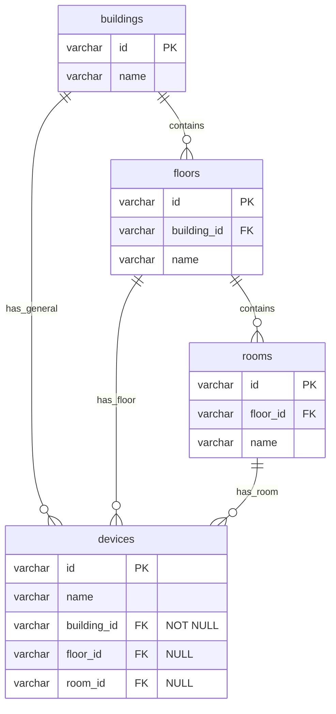

# ADR 004: 장비(Device)와 설치 위치(건물/층/호실) 관계의 DB 구조 설계 제안

- **상태**: 제안됨 (Proposed)
- **작성일자**: 2026-06-30
- **작성자**: Lead Engineer Agent

---

## 1. 배경 및 컨텍스트
현재 장비(Device) 테이블은 호실(Room) 정보와 직접 연결되어 있습니다. 그러나 요구사항에 따르면 장비는 다음 세 가지 계층 구조 중 어느 곳이든 배치될 수 있어야 합니다.
1. **건물(Building) 단위 장비** (예: 건물 로비 종합 안내판)
2. **층(Floor) 단위 장비** (예: 엘리베이터 앞 층별 안내판)
3. **호실(Room) 단위 장비** (예: 특정 빈소 입구 영정 DID)

또한, 운영 효율을 위해 장비를 다른 건물, 다른 층, 혹은 다른 호실로 자유롭게 재배치(이동)할 수 있어야 합니다. RDB 환경(PostgreSQL)에서 데이터 무결성을 보장하면서도 유연하게 이동을 지원할 수 있는 DB 구조 설계가 필요합니다.

---

## 2. DB 구조 설계 대안 비교

### 대안 A: 계층형 Nullable 외래키 매핑 구조 (추천)
장비 테이블에 `building_id` (필수), `floor_id` (선택), `room_id` (선택) 외래키 컬럼을 모두 두는 구조입니다.

```sql
CREATE TABLE smfr.devices (
    id VARCHAR(50) PRIMARY KEY,
    name VARCHAR(100) NOT NULL,
    building_id VARCHAR(50) NOT NULL, -- 모든 장비는 최소한 건물 소속임
    floor_id VARCHAR(50) NULL,        -- 층 장비인 경우 입력
    room_id VARCHAR(50) NULL,         -- 호실 장비인 경우 입력
    CONSTRAINT fk_devices_building FOREIGN KEY (building_id) REFERENCES smfr.buildings(id),
    CONSTRAINT fk_devices_floor FOREIGN KEY (floor_id) REFERENCES smfr.floors(id),
    CONSTRAINT fk_devices_room FOREIGN KEY (room_id) REFERENCES smfr.rooms(id)
);
```

- **장점**:
  - **직관성**: 특정 장비가 어디에 설치되어 있는지 복잡한 JOIN 없이 즉시 단일 행 조회로 파악할 수 있어 프론트엔드 그리드 표현 시 매우 빠릅니다.
  - **무결성**: RDB 고유의 물리 Foreign Key 제약조건을 그대로 활용할 수 있어, 존재하지 않는 건물/층/호실 ID가 들어오는 것을 완벽하게 방지합니다.
  - **이동성**: 장비를 다른 호실이나 건물로 옮길 때 해당 컬럼들의 값만 UPDATE 해주면 되므로 직관적입니다.
- **단점**:
  - 데이터 정합성 규칙(`room_id`가 지정되었는데 `floor_id`가 비어있거나, 타 건물의 호실 ID가 매핑되는 상황 등)을 방증하기 위해 데이터 입력/수정 시 애플리케이션 레벨의 validation 로직(또는 DB Trigger/Check Constraint)이 추가로 필요합니다.

---

### 대안 B: 다형성 매핑 (Polymorphic Association) 구조
장비 테이블에 위치 유형(`location_type`)과 대상 ID(`location_id`)를 분리하여 관리하는 구조입니다.

```sql
CREATE TABLE smfr.devices (
    id VARCHAR(50) PRIMARY KEY,
    name VARCHAR(100) NOT NULL,
    location_type VARCHAR(20) NOT NULL, -- 'BUILDING', 'FLOOR', 'ROOM'
    location_id VARCHAR(50) NOT NULL    -- 각각 건물ID, 층ID, 호실ID 바인딩
);
```

- **장점**:
  - **확장성**: 추후 '구역(Zone)', '야외주차장(Parking)' 등 새로운 위치 스키마가 추가되어도 테이블 스키마(컬럼) 수정 없이 위치를 연결할 수 있습니다.
  - **간결함**: 설치 위치를 나타내는 필드가 단 2개로 압축됩니다.
- **단점**:
  - **물리 제약 결여**: RDB의 물리 FK 제약조건을 적용할 수 없어 데이터 정합성 보장을 전적으로 애플리케이션에 의존해야 합니다.
  - **JOIN 성능**: 위치 타입에 따라 분기하여 건물/층/호실 테이블과 동적 JOIN해야 하므로, 데이터 조회 및 통계 쿼리 작성 시 SQL 복잡도가 매우 증가합니다.

---

### 대안 C: 위치 계층 통합 구조 (Unified Location Path)
위치의 계층구조를 나타내는 통합 위치 마스터 테이블(`locations`)을 생성하고, 건물/층/호실을 모두 이 마스터 테이블의 노드로 관리한 뒤, 장비는 단 하나의 `location_id`만 바라보는 구조입니다.

- **장점**:
  - 장비 엔티티가 물리적으로 단 하나의 `LocationId` 외래키만 참조하여 관계 모델이 가장 정형화됩니다.
  - 장비 이동 시 하나의 외래키만 변경하면 됩니다.
- **단점**:
  - 기존에 이미 분리되어 구축된 건물, 층, 호실 테이블 구조를 전면 통합형 트리 구조로 전환(마이그레이션)해야 하므로 공수가 매우 크고 설계 복잡도가 높습니다.

---

## 3. 의사 결정 및 추천 (Recommendation)
**대안 A (계층형 Nullable 외래키 매핑 구조)**를 강력히 추천합니다.

### 추천 사유:
1. **성능과 쿼리 편의성**: 장비 목록 화면 및 DID 현황 모니터링 시 "어느 건물, 몇 층, 어느 호실"에 위치하는지 즉시 인덱스 스캔만으로 조회가 가능합니다.
2. **물리적 무결성**: 건물, 층, 호실 테이블에 각각 정상적으로 FK 제약조건을 맺을 수 있어 DB 레벨의 참조 무결성을 유지하기 쉽습니다.
3. **이동(재배치) 시나리오**:
   - **호실 내 이동**: `room_id` 및 `floor_id`, `building_id`를 대상 호실 기준으로 한 번에 수정.
   - **호실에서 공용 공간(층 복도)으로 이동**: `room_id`를 `NULL`로 변경하고 `floor_id`만 유지.
   - **창고(건물 공용)로 이동**: `room_id`와 `floor_id`를 `NULL`로 처리하고 `building_id`만 유지.

이러한 상태 변화가 Nullable 컬럼의 유무로 매우 직관적으로 표현됩니다.
또한 애플리케이션 레벨(C# Service)에서 저장(Upsert)하기 전, 상위 부모 계층 관계가 올바른지 유효성 검사하는 로직(예: 선택한 `room_id`의 층이 `floor_id`와 일치하는지)을 간단히 태워 검증을 보완하는 구조가 가장 안전합니다.

---

## 4. 제안하는 물리 데이터 모델 (ERD)


